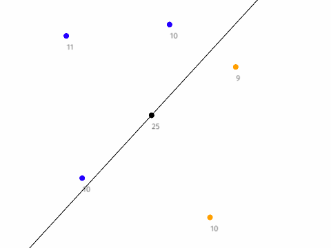

# Windmill

A game inspired by the [nice visualization](https://www.youtube.com/watch?v=M64HUIJFTZM) of a problem from the [52nd International
Mathematical Olympiad](https://www.imo-official.org/problems/IMO2011SL.pdf).

## Problem statement

Let `S` be a finite set of at least two points in the plane. Assume that no three points of `S` are
collinear. By a windmill we mean a process as follows. Start with a line `l` going through a
point `P ∈ S`. Rotate `l` clockwise around the pivot `P` until the line contains another point `Q`
of `S`. The point `Q` now takes over as the new pivot. This process continues indefinitely, with
the pivot always being a point from `S`.

Show that for a suitable `P ∈ S` and a suitable starting line `l` containing `P`, the resulting
windmill will visit each point of `S` as a pivot infinitely often.

## Usage

`cargo run`

| Key | Action |
| :---: | --- |
| R | reset |
| U | increase speed |
| D | decrease speed |

## TDD tasks

- Use proptest and criterion to assert that line contains a point algorithm is fast and solid
- Generate a set of non-collinear points with proptest and assert that there is a solution
